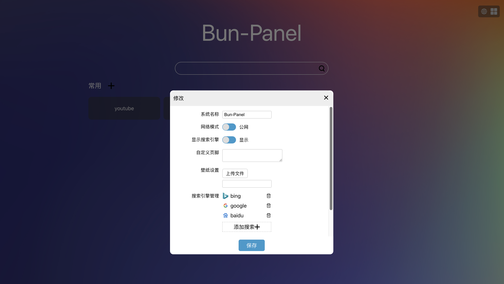

# bun-panel
> bunjs开发,基于 sqlite 的 nas 导航面板.
> 


To install dependencies:

```bash
bun install
```

To run:

```bash
bun start
```

## TODO
- [x] api设计
- [x] api开发
- [x] api测试
- [x] 添加修改分组和应用
- [ ] 删除应用
- [ ] 分组和应用排序

This project was created using `bun init` in bun v1.1.26. [Bun](https://bun.sh) is a fast all-in-one JavaScript runtime.

## design
- groups: 分组表, id,nth,name,fold(是否折叠)
- apps: 应用表, id,name,desc,cover,url_lan,url_wan,gid,type,open,bg_color
- engines: title,name,icon,url
- images: id,filepath,created_time,title
- config: 配置表, name,title,value(string)
  - mode: local/network
  - engine: 默认google
  - title: 系统名称 Bun-Panel
  - logo: 系统 logo
  - background_url: 系统背景

## api
- group
  - `get    /api/groups`
  - `post   /api/groups`
  - `put    /api/groups/:id`
  - `delete /api/groups/:id`
- app
  - `get    /api/apps`
  - `post   /api/apps`
  - `put    /api/apps/:id`
  - `delete /api/apps/:id`
- engine
  - `get    /api/engines`
  - `post   /api/engines`
  - `put    /api/engines/:name`
  - `delete /api/engines/:name`
- images
  - `get    /api/images`
  - `post   /api/images`
  - `delete /api/images/:id`
- config
  - 批量修改: `put    /api/config/`
  - `put    /api/configs/:name`
  - `get    /api/configs`
  - `delete /api/configs/:name`